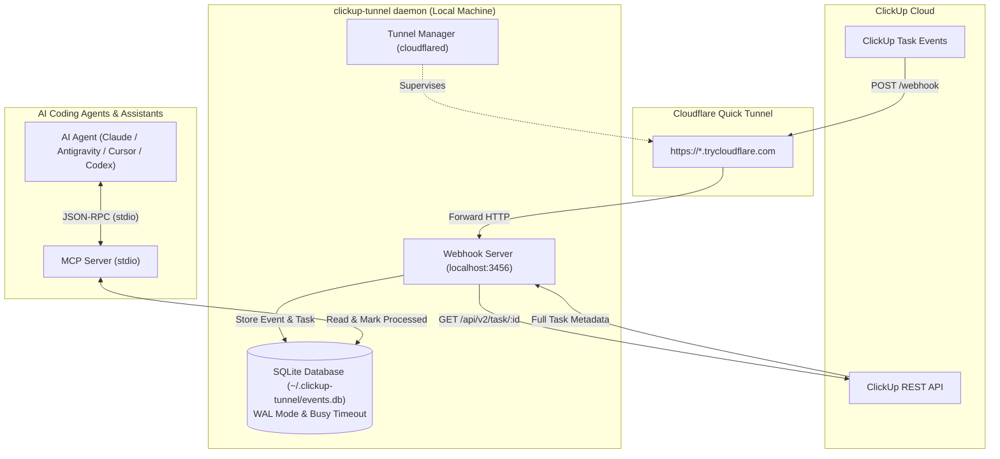
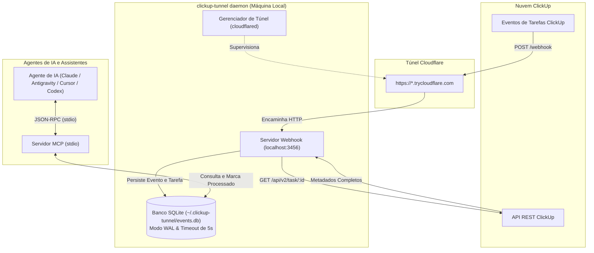

# @rafadepaula/clickup-tunnel

[](https://www.npmjs.com/package/@rafadepaula/clickup-tunnel)
[](https://opensource.org/licenses/MIT)
[](https://nodejs.org/)
[](https://github.com/rafadepaula/clickup-tunnel)
[](https://www.typescriptlang.org/)

> **Bridge ClickUp webhooks seamlessly into local AI agents (Claude Desktop, Antigravity, Cursor, Codex) using Cloudflare Quick Tunnels, native SQLite (`node:sqlite`), and the Model Context Protocol (MCP).**

---

### Language / Idioma
- [English Documentation](#english)
- [Documentação em Português](#português)

---

<a name="english"></a>
## English Documentation

### Overview

When building AI workflows, autonomous coding agents, or team assistants that react to project management updates, receiving incoming ClickUp webhooks locally is notoriously difficult:
- Your local development machine or desktop agent is behind NAT/firewalls without a public IP.
- Setting up cloud webhooks requires configuring public lambdas, API gateways, databases, and continuous synchronization.
- Exposing ports via temporary URLs often leaves stale, broken webhooks inside your ClickUp workspace.

**`@rafadepaula/clickup-tunnel`** solves this end-to-end with zero infrastructure:
1. **Cloudflare Quick Tunnel**: Spawns an encrypted `trycloudflare.com` tunnel (or connects your custom domain) on the fly via `cloudflared`.
2. **Auto-Registration**: Automatically registers the public tunnel webhook endpoint in your ClickUp workspace using your API token.
3. **Data Enrichment**: When task events arrive (`taskCreated`, `taskUpdated`, `taskStatusUpdated`, etc.), it automatically queries the ClickUp REST API to retrieve full task metadata (name, status, tags, custom fields, description).
4. **Local SQLite Queue**: Stores events and task states in a local SQLite database (`node:sqlite` in WAL mode) with transaction safety and concurrency protection.
5. **Model Context Protocol (MCP) Server**: Provides a standard stdio MCP server for Claude Desktop, Antigravity, Cursor, and custom agent loops to query pending tasks, inspect histories, and mark tasks as processed.
6. **Clean Teardown**: Upon stopping (`Ctrl+C` or `SIGTERM`), it automatically removes the registered webhook from ClickUp, preventing orphaned webhooks.

---

### Architecture



---

### Prerequisites

1. **Node.js 22.0.0 or higher** (requires native `node:sqlite` support with `DatabaseSync`).
2. **`cloudflared` CLI** installed and available in your `$PATH`.
   - **Linux**:
     ```bash
     # Debian/Ubuntu
     sudo apt-get install cloudflared
     # Arch Linux
     sudo pacman -S cloudflared
     ```
   - **macOS**:
     ```bash
     brew install cloudflared
     ```
   - **Windows**:
     ```powershell
     winget install Cloudflare.cloudflared
     ```
3. **ClickUp Personal API Token** (starts with `pk_...`). Get yours in ClickUp: **Settings > Apps > API Token > Generate**.

---

### Quick Start

#### 1. Run the Webhook Daemon

Run with `npx` directly:
```bash
CLICKUP_API_TOKEN="pk_your_token_here" npx @rafadepaula/clickup-tunnel start
```

Or install globally:
```bash
npm install -g @rafadepaula/clickup-tunnel
CLICKUP_API_TOKEN="pk_your_token_here" clickup-tunnel start
```

You will see:
```text
================================================================================
  ClickUp Tunnel Daemon Started
================================================================================
  Tunnel URL:    https://example-random-subdomain.trycloudflare.com
  Webhook ID:    wh_019283abc
  Team ID:       9018001234
  Listening:     http://localhost:3456
  SQLite DB:     /home/user/.clickup-tunnel/events.db
  Agent Command: npx @rafadepaula/clickup-tunnel mcp
================================================================================
```

#### 2. Configure Your AI Agent

You can connect any MCP-compatible AI agent or editor directly to the SQLite queue using the `mcp` command.

##### Claude Desktop

Add to your `claude_desktop_config.json`:
- **macOS**: `~/Library/Application Support/Claude/claude_desktop_config.json`
- **Windows**: `%APPDATA%\Claude\claude_desktop_config.json`
- **Linux**: `~/.config/Claude/claude_desktop_config.json`

```json
{
  "mcpServers": {
    "clickup-tunnel": {
      "command": "npx",
      "args": ["-y", "@rafadepaula/clickup-tunnel", "mcp"]
    }
  }
}
```

##### Antigravity / Gemini CLI

Add to your `mcp_servers` configuration:

```json
{
  "mcpServers": {
    "clickup-tunnel": {
      "command": "npx",
      "args": ["-y", "@rafadepaula/clickup-tunnel", "mcp"]
    }
  }
}
```

##### Cursor

Add to `.cursor/mcp.json` or configure in **Cursor Settings > Features > MCP Servers > Add New MCP Server**:
- **Name**: `clickup-tunnel`
- **Type**: `command`
- **Command**: `npx -y @rafadepaula/clickup-tunnel mcp`

##### Codex / Custom Scripts

Run the stdio server directly or pipe JSON-RPC:
```bash
npx @rafadepaula/clickup-tunnel mcp
```

---

### CLI Commands Reference

```bash
clickup-tunnel <command> [options]
```

| Command | Description |
|---|---|
| `start` | Launches HTTP server, opens Cloudflare Quick Tunnel, registers ClickUp webhook, and monitors events. |
| `mcp` | Starts the stdio MCP server for AI agents to query tasks from the local SQLite queue. |
| `status` | Displays queue metrics, count of pending events, top 10 pending tasks, and recent event logs. |
| `clean` | Cleans up orphaned or lingering `trycloudflare.com` / `clickup-tunnel` webhooks from ClickUp. |
| `help` | Displays command and option help. |
| `version` | Displays current package version. |

#### CLI Options & Flags

| Flag | Short | Environment Variable | Default | Description |
|---|---|---|---|---|
| `--token <token>` | `-t` | `CLICKUP_API_TOKEN` | None (Required) | ClickUp Personal API Token (`pk_...`). |
| `--port <port>` | `-p` | `PORT` | `3456` | Local HTTP port for webhook listener. |
| `--db <path>` | | `CLICKUP_TUNNEL_DB` | `~/.clickup-tunnel/events.db` | Custom path to SQLite database. |
| `--team <id>` | | `CLICKUP_TEAM_ID` | Auto-detected | ClickUp Workspace/Team ID. |
| `--url <url>` | | `WEBHOOK_PUBLIC_URL` | None | Public URL override (skips `cloudflared` tunnel). |
| `--help` | `-h` | | | Show CLI help. |
| `--version` | `-v` | | | Show CLI version. |

#### Example Commands

```bash
# Check queue and pending tasks
clickup-tunnel status

# Clean up dangling trycloudflare webhooks from your ClickUp workspace
CLICKUP_API_TOKEN="pk_..." clickup-tunnel clean

# Use a custom SQLite database location
clickup-tunnel start --db ./data/my-tasks.db

# Override tunnel URL when using your own domain/reverse proxy
clickup-tunnel start --url https://webhook.mycompany.com
```

---

### MCP Tools Reference

The MCP server exposes 5 tools over stdio:

#### 1. `get_pending_tasks`
Retrieves pending tasks and webhook events waiting for agent action.

- **Arguments**:
  - `limit` (*number*, optional, default: `10`): Maximum number of tasks to retrieve.
  - `tag` (*string*, optional): Filter tasks by a specific ClickUp tag (case-insensitive).
- **Example Call**:
  ```json
  {
    "name": "get_pending_tasks",
    "arguments": {
      "limit": 5,
      "tag": "ai-agent"
    }
  }
  ```
- **Example Response**:
  ```json
  [
    {
      "event_id": 1,
      "task_id": "86b12345",
      "name": "Fix authentication redirect bug",
      "status": "to do",
      "tags": ["bug", "ai-agent"],
      "description": "User is redirected to 404 after logging in.",
      "event_type": "taskCreated",
      "history_items": [],
      "received_at": "2026-10-03T22:30:00.000Z"
    }
  ]
  ```

#### 2. `mark_task_processed`
Updates the processing status of a webhook event with optional notes or summary.

- **Arguments**:
  - `event_id` (*number*, required): ID of the event record in SQLite.
  - `status` (*string*, optional, default: `'processed'`): One of `'processed'`, `'failed'`, `'ignored'`, `'in_progress'`, `'pending'`.
  - `notes` (*string*, optional): Summary of work done, error message, or PR link.
- **Example Call**:
  ```json
  {
    "name": "mark_task_processed",
    "arguments": {
      "event_id": 1,
      "status": "processed",
      "notes": "Diagnosed redirect logic and submitted PR #42 with test coverage."
    }
  }
  ```
- **Example Response**:
  ```text
  Event #1 successfully marked as 'processed'.
  ```

#### 3. `get_task_by_id`
Retrieves stored task details along with all recorded historical events for that task.

- **Arguments**:
  - `task_id` (*string*, required): ClickUp task ID (e.g., `"86b12345"`).
- **Example Call**:
  ```json
  {
    "name": "get_task_by_id",
    "arguments": {
      "task_id": "86b12345"
    }
  }
  ```
- **Example Response**:
  ```json
  {
    "task": {
      "id": "86b12345",
      "name": "Fix authentication redirect bug",
      "status": "in progress",
      "tags": ["bug", "ai-agent"],
      "description": "User is redirected to 404 after logging in.",
      "url": "https://app.clickup.com/t/86b12345",
      "list_id": "90180011",
      "list_name": "Sprint 12",
      "created_at": 1727994600000,
      "updated_at": 1727995000000
    },
    "events": [
      {
        "id": 1,
        "task_id": "86b12345",
        "event_type": "taskCreated",
        "processing_status": "processed",
        "agent_notes": "PR #42 opened",
        "received_at": 1727994600000,
        "processed_at": 1727995200000
      }
    ]
  }
  ```

#### 4. `list_recent_events`
Lists recently received events with optional limit and status filtering.

- **Arguments**:
  - `limit` (*number*, optional, default: `20`): Maximum events to return.
  - `status` (*string*, optional): Filter by status (`'pending'`, `'in_progress'`, `'processed'`, `'failed'`, `'ignored'`).
- **Example Call**:
  ```json
  {
    "name": "list_recent_events",
    "arguments": {
      "limit": 5,
      "status": "failed"
    }
  }
  ```

#### 5. `get_tunnel_status`
Returns information regarding the tunnel, webhook registration, and pending queue size.

- **Arguments**: None (`{}`)
- **Example Call**:
  ```json
  {
    "name": "get_tunnel_status",
    "arguments": {}
  }
  ```
- **Example Response**:
  ```json
  {
    "active": true,
    "tunnel_url": "https://example-random-subdomain.trycloudflare.com",
    "webhook_id": "wh_019283abc",
    "team_id": "9018001234",
    "pending_tasks_count": 3
  }
  ```

---

### Environment Variables

| Variable | Description | Default | Required? |
|---|---|---|---|
| `CLICKUP_API_TOKEN` | ClickUp Personal API Token (`pk_...`) | None | **Yes** (or `--token`) |
| `CLICKUP_TEAM_ID` | ClickUp Team/Workspace ID | Auto-detected from token | No |
| `PORT` | Local HTTP port for webhook listener | `3456` | No |
| `CLICKUP_TUNNEL_DB` | SQLite database file location | `~/.clickup-tunnel/events.db` | No |
| `WEBHOOK_PUBLIC_URL` | Public webhook URL override | None | No |
| `CLOUDFLARED_PATH` | Path to `cloudflared` binary | `cloudflared` | No |
| `CLOUDFLARED_TOKEN` | Token for Cloudflare Named Tunnel | None | No |
| `CLICKUP_WEBHOOK_SECRET` | ClickUp webhook secret for HMAC verification | None | No |

---

### Security Policy

- **Zero Insecure Local Fallbacks**: The CLI strictly rejects hardcoded credentials or reading from insecure plain text token files (such as `token.txt`). The token must strictly be supplied via the `CLICKUP_API_TOKEN` environment variable, a standard `.env` file, or the `--token` CLI flag.
- **Automatic Lifecycle Cleanup**: When shutting down the tunnel daemon (`SIGINT` / `SIGTERM`), the registered webhook is automatically deleted from ClickUp. This ensures you do not leave zombie endpoints targeting expired `trycloudflare.com` URLs.
- **Local Isolation**: The SQLite database is stored locally in user space (`~/.clickup-tunnel/events.db`) or your custom directory. No task contents or tokens are forwarded to any third-party telemetry service.

---

### Agent Autonomous Workflow Example

Here is how an autonomous agent routine handles tasks:

```text
1. Agent checks for new work:
   Tool: get_pending_tasks({ limit: 5, tag: "ai-agent" })
   Result: [ { event_id: 42, task_id: "86b456", name: "Implement User Avatar API", ... } ]

2. Agent inspects full task details:
   Tool: get_task_by_id({ task_id: "86b456" })

3. Agent marks work in progress:
   Tool: mark_task_processed({ event_id: 42, status: "in_progress", notes: "Writing tests and route" })

4. Agent completes work in codebase:
   - Writes code
   - Runs test suite
   - Creates git branch & commit

5. Agent marks event processed:
   Tool: mark_task_processed({
     event_id: 42,
     status: "processed",
     notes: "Implemented endpoint in src/avatar.ts, 12 tests passing, PR #15 created."
   })
```

---

### Programmatic Library API

You can also import and use `@rafadepaula/clickup-tunnel` inside your own Node.js / TypeScript projects:

```typescript
import {
  ClickUpClient,
  StorageDB,
  TunnelManager,
  WebhookServer,
  ClickUpTunnelMcpServer,
  startDaemon
} from '@rafadepaula/clickup-tunnel';

// Start daemon programmatically
const daemon = await startDaemon({
  token: process.env.CLICKUP_API_TOKEN,
  port: 3456
});

console.log('Tunnel URL:', daemon.tunnelUrl);

// Shutdown when done
await daemon.shutdown();
```

---

<a name="português"></a>
## Documentação em Português

### Visão Geral

Ao criar fluxos de trabalho com agentes de IA autônomos (como Claude Desktop, Antigravity, Cursor ou Codex) integrados à gestão de projetos, receber webhooks do ClickUp em ambiente local costuma ser um grande desafio:
- A máquina de desenvolvimento ou agente desktop opera atrás de NAT/firewall sem IP público.
- Configurar infraestrutura em nuvem exige lambdas públicas, API gateways, bancos de dados intermediários e sincronização constante.
- Expor portas com ferramentas manuais frequentemente deixa webhooks órfãos e inativos no ClickUp.

O **`@rafadepaula/clickup-tunnel`** resolve tudo isso sem necessidade de configuração de servidores:
1. **Túnel Rápido Cloudflare**: Cria um túnel criptografado `trycloudflare.com` em tempo real através do `cloudflared` (ou usa seu domínio personalizado).
2. **Auto-registro**: Registra automaticamente o webhook no seu espaço de trabalho do ClickUp usando seu token de API.
3. **Enriquecimento Assíncrono de Dados**: Ao receber eventos de tarefas (`taskCreated`, `taskUpdated`, etc.), consulta automaticamente a API REST do ClickUp para obter nome, status, tags, campos personalizados e descrição completa.
4. **Fila Local em SQLite**: Salva todos os eventos e dados em SQLite nativo do Node (`node:sqlite` em modo WAL) com proteção contra concorrência e transações seguras.
5. **Servidor MCP (Model Context Protocol)**: Oferece servidor MCP via `stdio` pronto para integração com Claude Desktop, Antigravity, Cursor e agentes customizados.
6. **Encerramento Limpo**: Ao desligar (`Ctrl+C` ou `SIGTERM`), remove automaticamente o webhook registrado no ClickUp.

---

### Arquitetura



---

### Pré-requisitos

1. **Node.js 22.0.0 ou superior** (com suporte nativo ao `node:sqlite` / `DatabaseSync`).
2. **CLI `cloudflared`** instalada e acessível no `$PATH` do sistema.
   - **Linux**: `sudo apt-get install cloudflared` ou `sudo pacman -S cloudflared`
   - **macOS**: `brew install cloudflared`
   - **Windows**: `winget install Cloudflare.cloudflared`
3. **Token de API Pessoal do ClickUp** (`pk_...`). Obtenha no ClickUp em: **Configurações > Apps > Token da API > Gerar**.

---

### Início Rápido

#### 1. Iniciar o Daemon de Webhook

Execute diretamente via `npx`:
```bash
CLICKUP_API_TOKEN="pk_seu_token_aqui" npx @rafadepaula/clickup-tunnel start
```

Ou instale globalmente:
```bash
npm install -g @rafadepaula/clickup-tunnel
CLICKUP_API_TOKEN="pk_seu_token_aqui" clickup-tunnel start
```

Saída no terminal:
```text
================================================================================
  ClickUp Tunnel Daemon Started
================================================================================
  Tunnel URL:    https://example-random-subdomain.trycloudflare.com
  Webhook ID:    wh_019283abc
  Team ID:       9018001234
  Listening:     http://localhost:3456
  SQLite DB:     /home/usuario/.clickup-tunnel/events.db
  Agent Command: npx @rafadepaula/clickup-tunnel mcp
================================================================================
```

#### 2. Configurar Agentes de IA

##### Claude Desktop

Edite o arquivo `claude_desktop_config.json`:
- **macOS**: `~/Library/Application Support/Claude/claude_desktop_config.json`
- **Windows**: `%APPDATA%\Claude\claude_desktop_config.json`
- **Linux**: `~/.config/Claude/claude_desktop_config.json`

```json
{
  "mcpServers": {
    "clickup-tunnel": {
      "command": "npx",
      "args": ["-y", "@rafadepaula/clickup-tunnel", "mcp"]
    }
  }
}
```

##### Antigravity / Gemini CLI

Adicione às configurações de `mcp_servers`:

```json
{
  "mcpServers": {
    "clickup-tunnel": {
      "command": "npx",
      "args": ["-y", "@rafadepaula/clickup-tunnel", "mcp"]
    }
  }
}
```

##### Cursor

Adicione em `.cursor/mcp.json` ou nas configurações do Cursor em **Features > MCP Servers**:
- **Nome**: `clickup-tunnel`
- **Tipo**: `command`
- **Comando**: `npx -y @rafadepaula/clickup-tunnel mcp`

---

### Comandos da CLI

```bash
clickup-tunnel <comando> [opções]
```

| Comando | Descrição |
|---|---|
| `start` | Inicia o servidor HTTP, o túnel Cloudflare, registra o webhook no ClickUp e monitora eventos. |
| `mcp` | Inicia o servidor MCP via `stdio` para agentes de IA consultarem tarefas do SQLite local. |
| `status` | Exibe estatísticas da fila, contagem de pendências, 10 tarefas principais e histórico recente. |
| `clean` | Remove webhooks antigos/órfãos do `trycloudflare.com` do seu espaço de trabalho no ClickUp. |
| `help` | Exibe a ajuda dos comandos e opções. |
| `version` | Exibe a versão instalada. |

#### Opções e Argumentos

| Opção | Abreviação | Variável de Ambiente | Padrão | Descrição |
|---|---|---|---|---|
| `--token <token>` | `-t` | `CLICKUP_API_TOKEN` | Nenhum (Obrigatório) | Token de API pessoal do ClickUp (`pk_...`). |
| `--port <porta>` | `-p` | `PORT` | `3456` | Porta HTTP local do servidor webhook. |
| `--db <caminho>` | | `CLICKUP_TUNNEL_DB` | `~/.clickup-tunnel/events.db` | Caminho do arquivo SQLite. |
| `--team <id>` | | `CLICKUP_TEAM_ID` | Auto-detectado | ID do workspace/time no ClickUp. |
| `--url <url>` | | `WEBHOOK_PUBLIC_URL` | Nenhum | URL pública para pular o túnel automático. |
| `--help` | `-h` | | | Exibe ajuda. |
| `--version` | `-v` | | | Exibe versão. |

---

### Ferramentas MCP Disponíveis

O servidor MCP disponibiliza 5 ferramentas nativas:

1. **`get_pending_tasks`**: Retorna tarefas e eventos pendentes na fila. Suporta `limit` (padrão: 10) e filtro por `tag`.
2. **`mark_task_processed`**: Atualiza o status do evento para `processed`, `failed`, `ignored` ou `in_progress`, com anotações opcionais (`notes`).
3. **`get_task_by_id`**: Busca detalhes completos da tarefa e todo o seu histórico de eventos no banco local por `task_id`.
4. **`list_recent_events`**: Lista os eventos recebidos recentemente com suporte a `limit` e filtro por `status`.
5. **`get_tunnel_status`**: Exibe o status da conexão, URL do túnel, ID do webhook e total de tarefas pendentes.

---

### Variáveis de Ambiente

| Variável | Descrição | Padrão | Obrigatória? |
|---|---|---|---|
| `CLICKUP_API_TOKEN` | Token pessoal da API ClickUp (`pk_...`) | Nenhum | **Sim** (ou flag `--token`) |
| `CLICKUP_TEAM_ID` | ID do workspace no ClickUp | Auto-detectado pelo token | Não |
| `PORT` | Porta HTTP do webhook local | `3456` | Não |
| `CLICKUP_TUNNEL_DB` | Localização do banco SQLite | `~/.clickup-tunnel/events.db` | Não |
| `WEBHOOK_PUBLIC_URL` | URL pública personalizada | Nenhum | Não |
| `CLOUDFLARED_PATH` | Caminho do binário `cloudflared` | `cloudflared` | Não |
| `CLOUDFLARED_TOKEN` | Token do túnel nomeado Cloudflare | Nenhum | Não |
| `CLICKUP_WEBHOOK_SECRET` | Segredo para validação HMAC do webhook | Nenhum | Não |

---

### Segurança e Boas Práticas

- **Zero Fallback para Arquivos de Senha**: O sistema proíbe leitura de arquivos inseguros em texto plano (como `token.txt`). O token de API deve ser sempre fornecido via variável de ambiente `CLICKUP_API_TOKEN`, arquivo `.env` ou parâmetro `--token`.
- **Limpeza Automática no Desligamento**: Ao interromper o serviço (`SIGINT`/`SIGTERM`), o webhook registrado é imediatamente desregistrado da API do ClickUp, evitando webhooks órfãos.
- **Dados Mantidos Localmente**: O banco de dados SQLite fica salvo no computador do desenvolvedor (`~/.clickup-tunnel/events.db`). Nenhum dado de tarefas ou credencial é transmitido para serviços de terceiros.

---

### Licença

Distribuído sob a licença **MIT**. Consulte o arquivo [LICENSE](LICENSE) para obter mais detalhes.

Copyright (c) 2026 **Rafael de Paula**.
