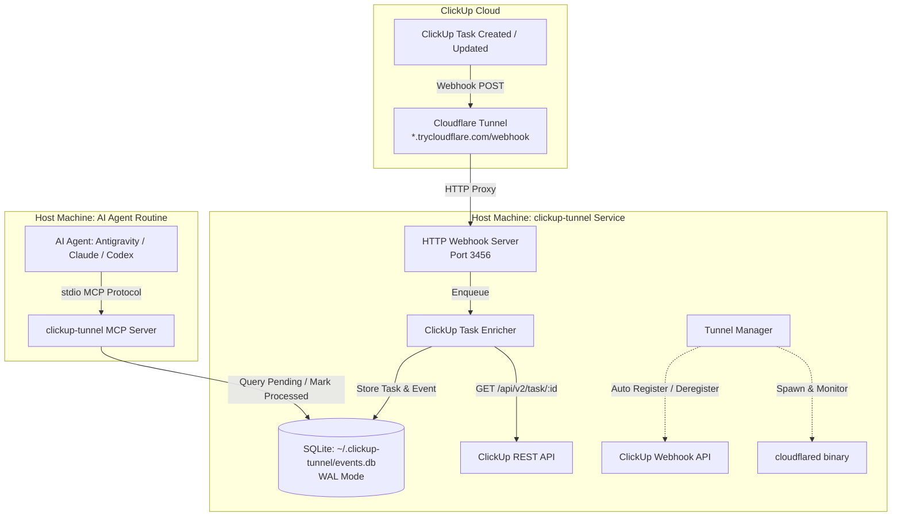

# Design Spec: ClickUp Tunnel & Agent MCP Server

**Date:** 2026-10-03  
**Package:** `@rafadepaula/clickup-tunnel`  
**GitHub:** `https://github.com/rafadepaula/clickup-tunnel`  
**License:** MIT  

---

## 1. Overview & Goals

Create an end-to-end automated pipeline connecting ClickUp task lifecycle events to local AI agents (Claude Code, Antigravity, Codex, Cursor, etc.) via Cloudflare Tunnel and an MCP (Model Context Protocol) server.

### Workflow:
1. **ClickUp Event**: User or automation creates or updates a task in ClickUp.
2. **Cloudflare Tunnel**: Receives the webhook HTTPS request publicly and routes it to local `clickup-tunnel` HTTP service.
3. **Task Enrichment & SQLite Persistence**: The service fetches the full task details (name, status, tags, description) from ClickUp API and stores it in SQLite (`~/.clickup-tunnel/events.db` or `./data/events.db`).
4. **Agent Routine Execution**: An AI agent wakes up or runs its periodic routine.
5. **MCP Tool Calls**: Agent connects via `npx -y @rafadepaula/clickup-tunnel mcp` to query `get_pending_tasks`.
6. **Task Execution**: Agent performs the task requested in ClickUp.
7. **Status Update**: Agent calls `mark_task_processed` with completion status and optional execution notes.

---

## 2. Architecture & Components



### Components:
1. **CLI Entrypoint (`bin/clickup-tunnel.ts` -> `dist/cli.js`)**:
   - `clickup-tunnel start` / `daemon`: Starts HTTP receiver, spawns `cloudflared`, discovers public URL, registers webhook in ClickUp, and orchestrates shutdown.
   - `clickup-tunnel mcp`: Starts stdio MCP server for agent integration.
   - `clickup-tunnel status`: Prints active tunnel status, public URL, active webhook, and database statistics.
   - `clickup-tunnel clean`: Removes dangling webhooks from ClickUp.

2. **HTTP Webhook Server (`src/server/webhook.ts`)**:
   - Lightweight HTTP server (Node `http` or `hono/node-server`).
   - Default port: `3456` (configurable via `PORT` env).
   - Routes:
     - `POST /webhook`: Immediately responds with `200 OK` (JSON: `{ received: true }`), passes payload to Enricher asynchronously.
     - `GET /health`: Returns `{ status: "ok", timestamp: ... }`.

3. **Cloudflare Tunnel Manager (`src/tunnel/cloudflared.ts`)**:
   - Auto-detects installed `cloudflared` binary (e.g. `/home/linuxbrew/.linuxbrew/bin/cloudflared` or in `$PATH`).
   - Spawns `cloudflared tunnel --url http://127.0.0.1:<PORT>`.
   - Parses stderr for regex `https://[-a-zA-Z0-9]+\.trycloudflare\.com`.
   - Accepts manual overrides:
     - `WEBHOOK_PUBLIC_URL`: If user has custom domain / persistent tunnel.
     - `CLOUDFLARE_TUNNEL_TOKEN`: If running a named tunnel token.
   - On exit (`SIGINT`/`SIGTERM`), calls ClickUp API to delete registered webhook and terminates child process.

4. **ClickUp Client & Enricher (`src/clickup/client.ts`)**:
   - Reads `CLICKUP_API_TOKEN` strictly from environment variable `CLICKUP_API_TOKEN`, `.env` file, or `--token` CLI argument (NO hardcoded paths or filesystem fallbacks, strictly secure for public distribution).
   - Auto-discovers Team ID (`/api/v2/team`) if `CLICKUP_TEAM_ID` is not explicitly set.
   - Webhook registration: `POST /api/v2/team/{team_id}/webhook` with events `taskCreated` and `taskUpdated`.
   - Task fetching: `GET /api/v2/task/{task_id}` to retrieve name, status, tags (marcadores), description, assignees, custom fields.

5. **Storage Layer (`src/storage/db.ts`)**:
   - Uses SQLite with WAL mode (`PRAGMA journal_mode = WAL;`) for high concurrency between writer daemon and reader MCP processes.
   - Default path: `~/.clickup-tunnel/events.db` (override with `CLICKUP_TUNNEL_DB` or `--db`).
   - Creates directories if they do not exist.

6. **MCP Server (`src/mcp/server.ts`)**:
   - Built with `@modelcontextprotocol/sdk`.
   - Runs over `StdioServerTransport`.
   - Tools:
     - `get_pending_tasks`: Retrieve pending tasks and events for the agent to work on.
     - `mark_task_processed`: Mark event status (`processed` | `failed` | `in_progress`) with optional execution summary notes.
     - `get_task_by_id`: Fetch full task details and event history from local database.
     - `list_recent_events`: Query recent webhook events with filters (`limit`, `status`).
     - `get_tunnel_status`: Inspect current tunnel URL, health, and queue metrics.

---

## 3. Data Model (SQLite Schema)

```sql
-- Tasks table: Stores latest state of the ClickUp task
CREATE TABLE IF NOT EXISTS tasks (
    id TEXT PRIMARY KEY,
    name TEXT NOT NULL,
    status TEXT NOT NULL,
    tags TEXT NOT NULL DEFAULT '[]', -- JSON array of strings e.g. ["bug", "urgent"]
    description TEXT,
    url TEXT,
    list_id TEXT,
    list_name TEXT,
    raw_json TEXT,                   -- Full task snapshot from ClickUp API
    created_at INTEGER NOT NULL,     -- ClickUp task creation timestamp (ms)
    updated_at INTEGER NOT NULL      -- Local updated timestamp (ms)
);

-- Webhook events table: Incoming events queue for agents
CREATE TABLE IF NOT EXISTS webhook_events (
    id INTEGER PRIMARY KEY AUTOINCREMENT,
    task_id TEXT NOT NULL,
    event_type TEXT NOT NULL,        -- 'taskCreated' | 'taskUpdated'
    history_items TEXT,              -- JSON array of changes from ClickUp webhook payload
    processing_status TEXT NOT NULL DEFAULT 'pending', -- 'pending' | 'in_progress' | 'processed' | 'failed'
    agent_notes TEXT,                -- Notes written by agent upon completion
    received_at INTEGER NOT NULL,    -- Timestamp received (ms)
    processed_at INTEGER,            -- Timestamp processed (ms)
    FOREIGN KEY(task_id) REFERENCES tasks(id)
);

CREATE INDEX IF NOT EXISTS idx_events_status ON webhook_events(processing_status);
CREATE INDEX IF NOT EXISTS idx_events_task_id ON webhook_events(task_id);
CREATE INDEX IF NOT EXISTS idx_events_received_at ON webhook_events(received_at);
```

---

## 4. MCP Tools Interface

### `get_pending_tasks`
- **Description:** Retrieve all pending tasks that require agent action.
- **Parameters:**
  - `limit` (number, optional, default: 10): Max number of pending tasks to return.
  - `tag` (string, optional): Filter tasks containing a specific tag/marker.
- **Returns:**
  ```json
  [
    {
      "event_id": 1,
      "task_id": "86bxy123",
      "name": "Fix authentication bug in login screen",
      "status": "in progress",
      "tags": ["bug", "agent-ready"],
      "description": "User reported 401 error...",
      "event_type": "taskCreated",
      "history_items": [],
      "received_at": "2026-10-03T21:30:00.000Z"
    }
  ]
  ```

### `mark_task_processed`
- **Description:** Mark a task event as processed or failed after agent completes work.
- **Parameters:**
  - `event_id` (number, required): Event ID returned from `get_pending_tasks`.
  - `status` (string, required): `'processed'` | `'failed'` | `'ignored'`.
  - `notes` (string, optional): Summary of actions taken by the agent.
- **Returns:** `{ "success": true, "event_id": 1, "status": "processed" }`

### `get_task_by_id`
- **Description:** Get full task details and event history from local database.
- **Parameters:**
  - `task_id` (string, required): ClickUp task ID.
- **Returns:** Task object with current name, status, tags, description, and list of all received webhook events.

### `list_recent_events`
- **Description:** List recently received webhook events for auditing.
- **Parameters:**
  - `limit` (number, optional, default: 20)
  - `status` (string, optional): Filter by processing status.

### `get_tunnel_status`
- **Description:** Get runtime status of the Cloudflare tunnel and webhook configuration.
- **Returns:** `{ "tunnel_url": "https://xxx.trycloudflare.com", "webhook_id": "...", "pending_tasks_count": 2 }`

---

## 5. Configuration & Environment Variables

| Variable | Description | Default |
|---|---|---|
| `CLICKUP_API_TOKEN` | ClickUp Personal API Token (`pk_...`) | *Required* |
| `CLICKUP_TEAM_ID` | ClickUp Team/Workspace ID | Auto-detected from token |
| `PORT` | Local HTTP Webhook Server Port | `3456` |
| `CLICKUP_TUNNEL_DB` | Path to SQLite database file | `~/.clickup-tunnel/events.db` |
| `WEBHOOK_PUBLIC_URL` | Override public URL instead of quick tunnel | (empty = quick tunnel) |
| `CLOUDFLARE_TUNNEL_TOKEN` | Named Cloudflare tunnel token (optional) | (empty = quick tunnel) |

---

## 6. Packaging & Deployment

- **GitHub Repository:** `https://github.com/rafadepaula/clickup-tunnel`
- **npm Scope:** `@rafadepaula/clickup-tunnel`
- **Agent Setup in Claude / Antigravity config:**
  ```json
  {
    "mcpServers": {
      "clickup-tunnel": {
        "command": "npx",
        "args": ["-y", "@rafadepaula/clickup-tunnel", "mcp"],
        "env": {
          "CLICKUP_TUNNEL_DB": "/home/rafael/.clickup-tunnel/events.db"
        }
      }
    }
  }
  ```

---

## 7. Error Handling & Resilience
- **Webhook acknowledgement**: Instant `200 OK` return before ClickUp API enrichment to prevent timeouts (ClickUp drops webhooks after 5s).
- **Graceful shutdown**: Captures `SIGINT` / `SIGTERM`, removes registered webhook from ClickUp API to avoid zombie webhooks, stops `cloudflared` process.
- **SQLite Concurrency**: Uses WAL mode and SQLite busy timeout (5000ms) to prevent database locks between server and MCP.
- **Auto-reconnect**: If `cloudflared` exits unexpectedly, the manager restarts it and updates the ClickUp webhook URL.
